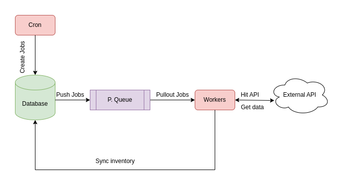

## Inventory Sync 🛸



### System 🤖
- **[Cron Job](https://github.com/AmalChandru/tickete-hiring-problem/pull/1)**: Triggers at scheduled intervals to create fetch jobs.  
- **Database**: Stores inventory data and tracks job execution.  
- **[Priority Queue](https://github.com/AmalChandru/tickete-hiring-problem/pull/2)**: Manages fetch jobs efficiently, ensuring timely execution.  
- **[Workers](https://github.com/AmalChandru/tickete-hiring-problem/pull/4)**: Pull jobs from the queue, fetch data from the external API, and update the database.  
- **[External API](https://github.com/AmalChandru/tickete-hiring-problem/pull/5)**: The source of inventory data, providing slot availability and pricing.  
- **[Sync Process](https://github.com/AmalChandru/tickete-hiring-problem/pull/7)**: Updates inventory in the database after successful data retrieval.  

### Code Glossary 🐉

```
tickete-hiring-problem
├── config/              # Configuration files (e.g., default settings, logger setup)
├── docs/                # Documentation for system design, API design, optimizations
│   ├── fetch-inventory.png  # System architecture diagram
│   ├── system_design.md     # System design details
│   ├── api_design.md        # API specifications
│   ├── optimization_strategies.md  # Performance improvements
│   └── api_call_feasibility_analysis.md  # Feasibility of API requests
├── prisma/              # Database schema and migrations (Prisma ORM)
│   └── schema.prisma    # Prisma schema defining the database structure
├── src/                 # Main source code for the project
│   ├── database/        # Database connection module (e.g., database service)
│   ├── enums/           # Enum definitions (e.g., fetch-period types)
│   ├── modules/         # Main business logic, divided into modules
│   │   ├── api-fetcher/ # Service for fetching data from external APIs
│   │   ├── experience/  # Experience-related API endpoints and logic
│   │   ├── inventory/   # Inventory synchronization logic
│   │   ├── queue/       # Priority queue implementation for processing jobs
│   │   ├── scheduler/   # Scheduler module for triggering jobs
│   │   └── workers/     # Worker services that process API fetch jobs
│   ├── app.module.ts    # Root module of the application
│   └── main.ts          # Entry point of the NestJS application
├── test/                # End-to-end tests
├── README.md            # Project documentation
├── package.json         # Project dependencies and scripts
├── tsconfig.json        # TypeScript configuration
├── nest-cli.json        # NestJS CLI configuration
└── LICENSE              # License information

```
### Notes 📚
1. [System design](./docs/system_design.md).
2. [API design](./docs/api_design.md).
3. [Optimization Strategies](./docs/optimization_strategies.md).
4. [API call feasibility analysis](./docs/api_call_feasibility_analysis.md).
5. [Setup guide.](./docs/setup_guide.md)


